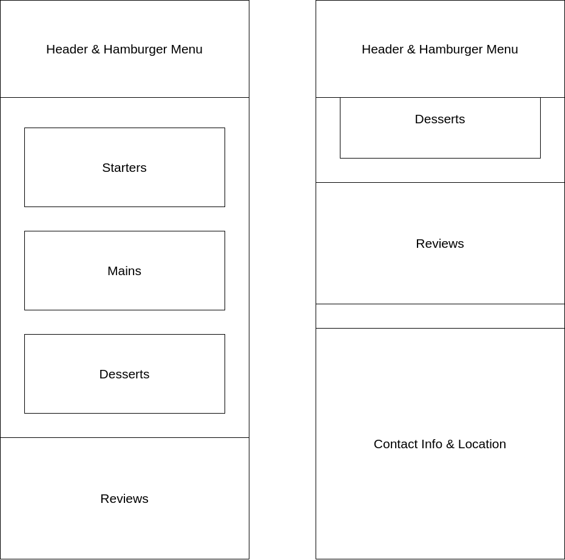
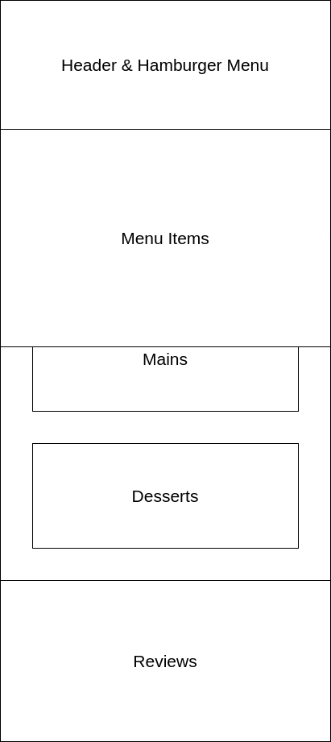

# Vegedible

## Wireframes

### Mobile

#### Homepage

The skeleton of the homepage when displayed on a mobile device:

The first image is when the page is scrolled to the top, the second is when it's scrolled to the bottom of the page.

Skeleton of the header's menu, having been opened on the homepage:

The skeleton of the menu is the same for all sections of the site.

## Models

### Customer

The customer model contains two fields:
* Email
* Name

The email field serves as the primary key of the 'Customer' table.
My reasoning for this choice is that there could be multiple customers with the same name, but they should each have a unique email address.

### Order

The order model contains the following fields:
* Customer
* Date & Time
* Table number

The customer field is a foreign key to the customer model, allowing each order to be associated with one customer.

The table number has to be unique for each date & time value.
The table number is also restricted to only accept integer values from 1 to 10.
