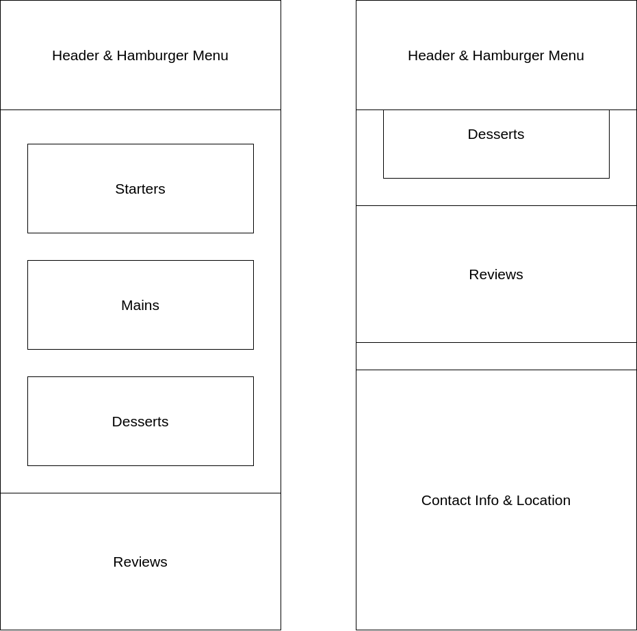
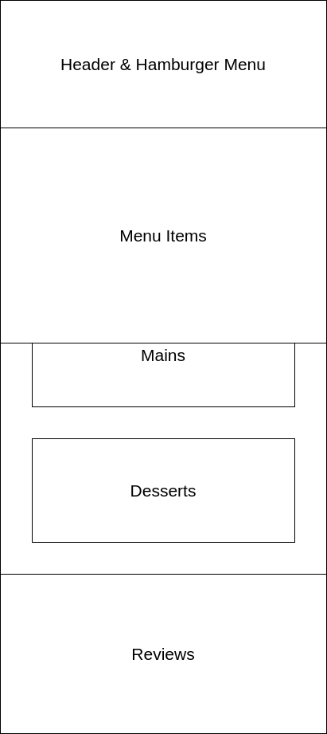
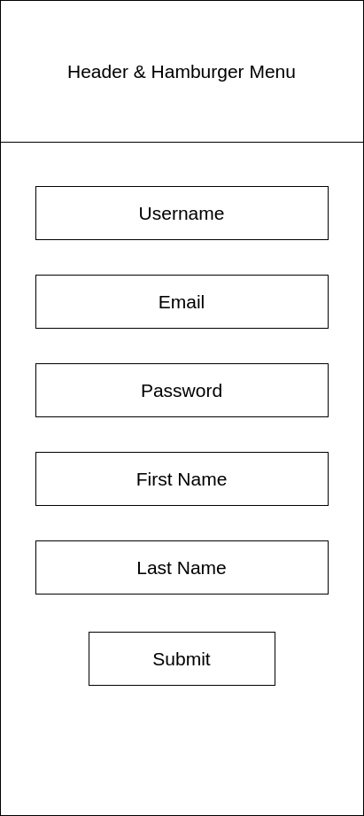
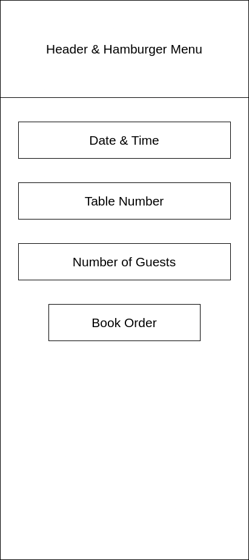
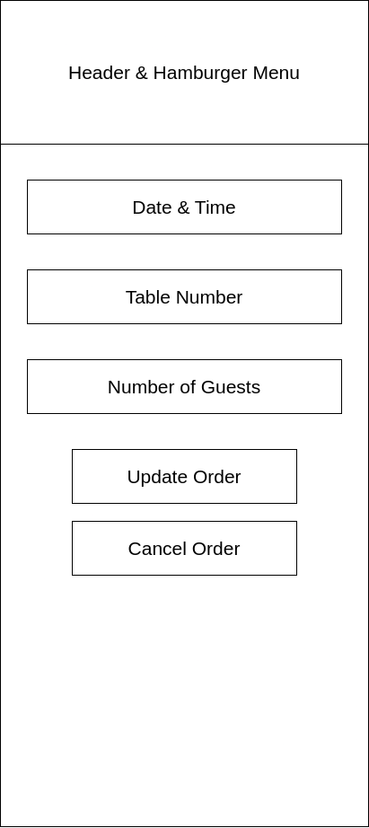
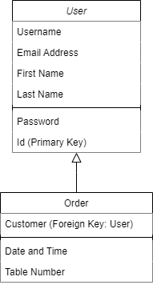

# Vegedible

## User stories & Agile design

I created a number of user stories to guide my planning and design of the booking application.

I made use of the Github issue tracker and created a board view of the stories, split into categories of 'Todo', 'In Progress' and 'Done'.
The board is viewable [here.](https://github.com/users/merlynjwa/projects/1)

## Wireframes

### Homepage

#### Mobile

The skeleton of the homepage when displayed on a mobile device:

The first image is when the page is scrolled to the top, the second is when it's scrolled to the bottom of the page.

Skeleton of the header's menu, having been opened on the homepage:

The skeleton of the menu is the same for all sections of the site.

### Sign Up Page

#### Mobile

The skeleton of the sign up page when it is displayed on a mobile device:

### Order Booking Page

#### Mobile

Skeleton of the booking page when you are first placing an order:

Skeleton of the booking page when you are updating a previously made order, either to change some of the details, or to cancel the order:

## Models

Diagram of the relationship between the two models designed for this application:

I designed two models for this application:
* User
* Order

### User

The user model contains the following fields:
* Email
* Username
* First name
* Last name
* Password (inherited from AbstractUser)

As I did not work out a way of including the first_name and last_name fields in to the form for the signup page, new users are created with this field being empty.

### Order

The order model contains the following fields:
* Customer
* Date & Time
* Table number

The customer field is a foreign key to the user model, allowing each order to be associated with one customer.

The table number has to be unique for each date & time value.
The table number is also restricted to only accept integer values from 1 to 10.

## Credits

### Google Fonts

I have imported 'Bebas Neue' and 'Comfortaa' from Google Fonts.
These two font families are provided under the [SIL Open Font License](https://scripts.sil.org/cms/scripts/page.php?site_id=nrsi&id=OFL)

### Django

Unsurprisingly, this project makes use of software libraries under the Django project.
This software is licensed under the [BSD 3-Clause license](https://github.com/django/django/blob/3.2.18/LICENSE), which is an open-source and free liberties license.

### Bootstrap

I made use of Bootstrap for this project.
This is available under an [MIT License](https://github.com/twbs/bootstrap/blob/v4-dev/LICENSE), which is an open source and free liberties license.

### Python

Again, unsurprisingly, this project makes use of Python.
Python software and documentation is licensed under the [PSF License Agreement](https://docs.python.org/3/license.html#psf-license)
